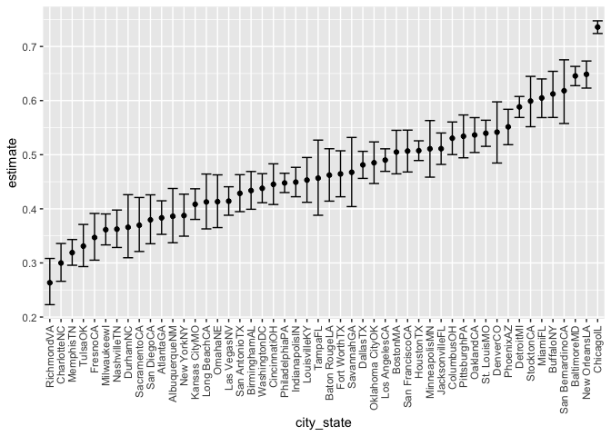

p8105_hw5_yz4187
================
Yiwen Zhao
11/20/2021

### problem 0

### Problem 1

``` r
homicide_df = 
  read_csv("./data/homicide-data.csv", na = c("", "Unknown")) %>%
  mutate(
    city_state = str_c(city, state),
    resolution = case_when(
      disposition == "Closed without arrest"  ~ "unsolved",
      disposition == "Open/No arrest"        ~ "unsolved",
      disposition == "Closed by arrest"       ~ "solved"
    )) %>%
  relocate(city_state) %>%
  filter(city_state != "TulsaAL")
```

    ## Rows: 52179 Columns: 12

    ## ── Column specification ────────────────────────────────────────────────────────
    ## Delimiter: ","
    ## chr (8): uid, victim_last, victim_first, victim_race, victim_sex, city, stat...
    ## dbl (4): reported_date, victim_age, lat, lon

    ## 
    ## ℹ Use `spec()` to retrieve the full column specification for this data.
    ## ℹ Specify the column types or set `show_col_types = FALSE` to quiet this message.

Let’s focus on Baltimore, MD.

``` r
baltimore_df = 
  homicide_df %>%
  filter(city_state == "BaltimoreMD")

baltimore_summary = 
  baltimore_df %>%
  summarize(
    unsolved = sum(resolution == "unsolved"),
    n = n()
  )

baltimore_test = 
  prop.test(
    x = baltimore_summary %>% pull(unsolved),
    n = baltimore_summary %>% pull(n))

baltimore_test %>%
  broom::tidy()
```

    ## # A tibble: 1 × 8
    ##   estimate statistic  p.value parameter conf.low conf.high method    alternative
    ##      <dbl>     <dbl>    <dbl>     <int>    <dbl>     <dbl> <chr>     <chr>      
    ## 1    0.646      239. 6.46e-54         1    0.628     0.663 1-sample… two.sided

Let’s try to interate across cities!

First off, write a function and test it on a few sample cities.

``` r
prop_test_function = function(city_df) {
  
  city_summary = 
  city_df %>%
  summarize(
    unsolved = sum(resolution == "unsolved"),
    n = n()
  )
  
  city_test = 
  prop.test(
    x = city_summary %>% pull(unsolved),
    n = city_summary %>% pull(n))
  
  return(city_test)
}

prop_test_function(baltimore_df)
```

    ## 
    ##  1-sample proportions test with continuity correction
    ## 
    ## data:  city_summary %>% pull(unsolved) out of city_summary %>% pull(n), null probability 0.5
    ## X-squared = 239.01, df = 1, p-value < 2.2e-16
    ## alternative hypothesis: true p is not equal to 0.5
    ## 95 percent confidence interval:
    ##  0.6275625 0.6631599
    ## sample estimates:
    ##         p 
    ## 0.6455607

``` r
homicide_df %>%
  filter(city_state == "AlbuquerqueNM") %>%
  prop_test_function()
```

    ## 
    ##  1-sample proportions test with continuity correction
    ## 
    ## data:  city_summary %>% pull(unsolved) out of city_summary %>% pull(n), null probability 0.5
    ## X-squared = 19.114, df = 1, p-value = 1.232e-05
    ## alternative hypothesis: true p is not equal to 0.5
    ## 95 percent confidence interval:
    ##  0.3372604 0.4375766
    ## sample estimates:
    ##         p 
    ## 0.3862434

Now, let;s iterate across all cities.

``` r
results_df = 
  homicide_df %>%
  nest(data = uid:resolution) %>%
  mutate(
    test_results = map(data, prop_test_function),
    tidy_results = map(test_results, broom::tidy)
  ) %>%
  select(city_state, tidy_results) %>%
  unnest(tidy_results) %>%
  select(city_state, estimate, starts_with("conf"))
```

Try to make a plot showing estimates and confidence inetrvals.

``` r
results_df %>%
  mutate(city_state = fct_reorder(city_state, estimate)) %>%
  ggplot(aes(x = city_state, y = estimate)) +
  geom_point() +
  geom_errorbar(aes(ymin = conf.low, ymax = conf.high)) +
  theme(axis.text.x = element_text(angle = 90, vjust = 0.5, hjust = 1))
```

<!-- -->

``` r
homicide_df %>%
  group_by(city_state) %>%
  summarize(
    unsolved = sum(resolution == "unsolved"),
    n = n()
  ) %>%
  mutate(
    test_results = map2(unsolved, n, prop.test),
    tidy_results = map(test_results, broom::tidy)
  ) %>%
  select(city_state, tidy_results) %>%
  unnest(tidy_results) %>%
  select(city_state, estimate, starts_with("conf"))
```

    ## # A tibble: 50 × 4
    ##    city_state    estimate conf.low conf.high
    ##    <chr>            <dbl>    <dbl>     <dbl>
    ##  1 AlbuquerqueNM    0.386    0.337     0.438
    ##  2 AtlantaGA        0.383    0.353     0.415
    ##  3 BaltimoreMD      0.646    0.628     0.663
    ##  4 Baton RougeLA    0.462    0.414     0.511
    ##  5 BirminghamAL     0.434    0.399     0.469
    ##  6 BostonMA         0.505    0.465     0.545
    ##  7 BuffaloNY        0.612    0.569     0.654
    ##  8 CharlotteNC      0.300    0.266     0.336
    ##  9 ChicagoIL        0.736    0.724     0.747
    ## 10 CincinnatiOH     0.445    0.408     0.483
    ## # … with 40 more rows

### Problem 2

``` r
tibble(
  files = list.files("./data/zip_data/")
)
```

    ## # A tibble: 0 × 1
    ## # … with 1 variable: files <chr>

### Problem 3

``` r
library(tidyverse)

set.seed(10)

iris_with_missing = iris %>%
  map_df(~replace(.x, sample(1:150, 20), NA)) %>%
  mutate(Species = as.character(Species))

view(iris_with_missing)
```

Write a function.

``` r
iris_with_missing = iris_with_missing %>%
  janitor::clean_names() 

fill_in_missing = function(x) {
  if (is.numeric(x)){
    x = ifelse(is.na(x), mean(x, na.rm = TRUE), x)
  }
  else if(is.character(x)){
    x = ifelse(is.na(x), "virginica", x)
  }
}
iris_cleaned = map(iris_with_missing, fill_in_missing) %>%
  as.tibble()
```

    ## Warning: `as.tibble()` was deprecated in tibble 2.0.0.
    ## Please use `as_tibble()` instead.
    ## The signature and semantics have changed, see `?as_tibble`.
    ## This warning is displayed once every 8 hours.
    ## Call `lifecycle::last_lifecycle_warnings()` to see where this warning was generated.

``` r
knitr::kable(iris_cleaned)
```

| sepal_length | sepal_width | petal_length | petal_width | species    |
|-------------:|------------:|-------------:|------------:|:-----------|
|     5.100000 |    3.500000 |     1.400000 |    0.200000 | setosa     |
|     4.900000 |    3.000000 |     1.400000 |    0.200000 | setosa     |
|     4.700000 |    3.200000 |     1.300000 |    0.200000 | setosa     |
|     4.600000 |    3.100000 |     1.500000 |    1.192308 | setosa     |
|     5.000000 |    3.600000 |     1.400000 |    0.200000 | setosa     |
|     5.400000 |    3.900000 |     1.700000 |    0.400000 | setosa     |
|     5.819231 |    3.400000 |     1.400000 |    0.300000 | setosa     |
|     5.000000 |    3.400000 |     1.500000 |    0.200000 | setosa     |
|     4.400000 |    2.900000 |     1.400000 |    0.200000 | setosa     |
|     4.900000 |    3.100000 |     3.765385 |    0.100000 | setosa     |
|     5.400000 |    3.075385 |     1.500000 |    0.200000 | setosa     |
|     4.800000 |    3.400000 |     1.600000 |    0.200000 | setosa     |
|     5.819231 |    3.075385 |     1.400000 |    0.100000 | setosa     |
|     4.300000 |    3.000000 |     3.765385 |    0.100000 | setosa     |
|     5.819231 |    4.000000 |     3.765385 |    0.200000 | setosa     |
|     5.700000 |    4.400000 |     1.500000 |    0.400000 | setosa     |
|     5.400000 |    3.900000 |     1.300000 |    0.400000 | setosa     |
|     5.100000 |    3.500000 |     1.400000 |    1.192308 | setosa     |
|     5.700000 |    3.800000 |     1.700000 |    0.300000 | setosa     |
|     5.100000 |    3.800000 |     1.500000 |    1.192308 | setosa     |
|     5.400000 |    3.400000 |     1.700000 |    0.200000 | setosa     |
|     5.100000 |    3.700000 |     1.500000 |    0.400000 | virginica  |
|     4.600000 |    3.600000 |     1.000000 |    0.200000 | setosa     |
|     5.819231 |    3.300000 |     3.765385 |    0.500000 | setosa     |
|     4.800000 |    3.400000 |     1.900000 |    0.200000 | virginica  |
|     5.000000 |    3.000000 |     3.765385 |    0.200000 | setosa     |
|     5.000000 |    3.400000 |     1.600000 |    0.400000 | virginica  |
|     5.200000 |    3.500000 |     1.500000 |    0.200000 | setosa     |
|     5.819231 |    3.400000 |     1.400000 |    0.200000 | setosa     |
|     4.700000 |    3.200000 |     1.600000 |    0.200000 | setosa     |
|     4.800000 |    3.100000 |     3.765385 |    0.200000 | setosa     |
|     5.400000 |    3.075385 |     1.500000 |    0.400000 | setosa     |
|     5.200000 |    3.075385 |     1.500000 |    0.100000 | setosa     |
|     5.500000 |    4.200000 |     1.400000 |    0.200000 | setosa     |
|     4.900000 |    3.100000 |     3.765385 |    0.200000 | setosa     |
|     5.000000 |    3.200000 |     1.200000 |    0.200000 | setosa     |
|     5.500000 |    3.500000 |     1.300000 |    0.200000 | setosa     |
|     4.900000 |    3.600000 |     1.400000 |    0.100000 | setosa     |
|     4.400000 |    3.000000 |     1.300000 |    1.192308 | setosa     |
|     5.100000 |    3.400000 |     1.500000 |    0.200000 | setosa     |
|     5.000000 |    3.500000 |     1.300000 |    0.300000 | setosa     |
|     4.500000 |    3.075385 |     1.300000 |    1.192308 | virginica  |
|     4.400000 |    3.200000 |     1.300000 |    0.200000 | setosa     |
|     5.000000 |    3.500000 |     1.600000 |    0.600000 | setosa     |
|     5.100000 |    3.800000 |     1.900000 |    0.400000 | setosa     |
|     4.800000 |    3.000000 |     1.400000 |    0.300000 | virginica  |
|     5.100000 |    3.800000 |     1.600000 |    0.200000 | setosa     |
|     4.600000 |    3.200000 |     3.765385 |    0.200000 | setosa     |
|     5.300000 |    3.700000 |     1.500000 |    0.200000 | setosa     |
|     5.000000 |    3.075385 |     1.400000 |    0.200000 | setosa     |
|     7.000000 |    3.075385 |     4.700000 |    1.400000 | virginica  |
|     6.400000 |    3.200000 |     4.500000 |    1.500000 | versicolor |
|     6.900000 |    3.100000 |     4.900000 |    1.500000 | versicolor |
|     5.500000 |    2.300000 |     4.000000 |    1.300000 | versicolor |
|     6.500000 |    2.800000 |     4.600000 |    1.500000 | versicolor |
|     5.700000 |    2.800000 |     4.500000 |    1.300000 | versicolor |
|     6.300000 |    3.300000 |     4.700000 |    1.600000 | virginica  |
|     4.900000 |    2.400000 |     3.765385 |    1.000000 | versicolor |
|     6.600000 |    2.900000 |     4.600000 |    1.300000 | virginica  |
|     5.200000 |    2.700000 |     3.900000 |    1.400000 | versicolor |
|     5.000000 |    2.000000 |     3.765385 |    1.000000 | versicolor |
|     5.900000 |    3.000000 |     4.200000 |    1.500000 | versicolor |
|     6.000000 |    2.200000 |     4.000000 |    1.192308 | versicolor |
|     6.100000 |    2.900000 |     4.700000 |    1.400000 | versicolor |
|     5.600000 |    2.900000 |     3.600000 |    1.300000 | versicolor |
|     6.700000 |    3.100000 |     4.400000 |    1.400000 | versicolor |
|     5.600000 |    3.000000 |     4.500000 |    1.500000 | versicolor |
|     5.800000 |    3.075385 |     4.100000 |    1.000000 | versicolor |
|     6.200000 |    2.200000 |     4.500000 |    1.500000 | versicolor |
|     5.600000 |    2.500000 |     3.900000 |    1.100000 | versicolor |
|     5.900000 |    3.200000 |     4.800000 |    1.800000 | versicolor |
|     5.819231 |    2.800000 |     4.000000 |    1.300000 | virginica  |
|     6.300000 |    2.500000 |     4.900000 |    1.500000 | versicolor |
|     5.819231 |    2.800000 |     3.765385 |    1.200000 | versicolor |
|     6.400000 |    2.900000 |     4.300000 |    1.300000 | versicolor |
|     6.600000 |    3.000000 |     4.400000 |    1.400000 | versicolor |
|     6.800000 |    2.800000 |     4.800000 |    1.400000 | versicolor |
|     6.700000 |    3.075385 |     5.000000 |    1.192308 | versicolor |
|     6.000000 |    3.075385 |     4.500000 |    1.192308 | versicolor |
|     5.700000 |    2.600000 |     3.500000 |    1.000000 | virginica  |
|     5.500000 |    2.400000 |     3.800000 |    1.100000 | versicolor |
|     5.819231 |    2.400000 |     3.700000 |    1.000000 | versicolor |
|     5.800000 |    2.700000 |     3.900000 |    1.200000 | versicolor |
|     6.000000 |    2.700000 |     5.100000 |    1.600000 | versicolor |
|     5.400000 |    3.000000 |     4.500000 |    1.500000 | versicolor |
|     5.819231 |    3.400000 |     4.500000 |    1.600000 | versicolor |
|     6.700000 |    3.100000 |     4.700000 |    1.192308 | versicolor |
|     5.819231 |    3.075385 |     4.400000 |    1.300000 | versicolor |
|     5.600000 |    3.000000 |     3.765385 |    1.192308 | versicolor |
|     5.500000 |    2.500000 |     4.000000 |    1.192308 | versicolor |
|     5.500000 |    3.075385 |     4.400000 |    1.200000 | versicolor |
|     5.819231 |    3.075385 |     4.600000 |    1.192308 | versicolor |
|     5.800000 |    3.075385 |     4.000000 |    1.192308 | versicolor |
|     5.000000 |    2.300000 |     3.300000 |    1.192308 | virginica  |
|     5.819231 |    2.700000 |     4.200000 |    1.300000 | versicolor |
|     5.700000 |    3.000000 |     4.200000 |    1.200000 | versicolor |
|     5.700000 |    2.900000 |     4.200000 |    1.300000 | versicolor |
|     6.200000 |    2.900000 |     4.300000 |    1.300000 | versicolor |
|     5.100000 |    2.500000 |     3.000000 |    1.192308 | versicolor |
|     5.700000 |    2.800000 |     4.100000 |    1.300000 | virginica  |
|     6.300000 |    3.075385 |     3.765385 |    2.500000 | virginica  |
|     5.800000 |    2.700000 |     5.100000 |    1.900000 | virginica  |
|     7.100000 |    3.000000 |     5.900000 |    2.100000 | virginica  |
|     6.300000 |    2.900000 |     5.600000 |    1.800000 | virginica  |
|     6.500000 |    3.075385 |     5.800000 |    2.200000 | virginica  |
|     7.600000 |    3.000000 |     6.600000 |    2.100000 | virginica  |
|     4.900000 |    2.500000 |     4.500000 |    1.700000 | virginica  |
|     7.300000 |    2.900000 |     6.300000 |    1.800000 | virginica  |
|     6.700000 |    3.075385 |     3.765385 |    1.800000 | virginica  |
|     5.819231 |    3.600000 |     3.765385 |    2.500000 | virginica  |
|     6.500000 |    3.200000 |     5.100000 |    2.000000 | virginica  |
|     5.819231 |    2.700000 |     5.300000 |    1.900000 | virginica  |
|     6.800000 |    3.000000 |     5.500000 |    2.100000 | virginica  |
|     5.700000 |    3.075385 |     5.000000 |    2.000000 | virginica  |
|     5.800000 |    2.800000 |     5.100000 |    2.400000 | virginica  |
|     6.400000 |    3.200000 |     5.300000 |    2.300000 | virginica  |
|     6.500000 |    3.000000 |     3.765385 |    1.800000 | virginica  |
|     7.700000 |    3.800000 |     6.700000 |    1.192308 | virginica  |
|     7.700000 |    2.600000 |     6.900000 |    2.300000 | virginica  |
|     6.000000 |    2.200000 |     5.000000 |    1.500000 | virginica  |
|     5.819231 |    3.200000 |     5.700000 |    1.192308 | virginica  |
|     5.600000 |    3.075385 |     4.900000 |    2.000000 | virginica  |
|     7.700000 |    2.800000 |     6.700000 |    2.000000 | virginica  |
|     6.300000 |    2.700000 |     4.900000 |    1.800000 | virginica  |
|     6.700000 |    3.300000 |     5.700000 |    2.100000 | virginica  |
|     7.200000 |    3.200000 |     6.000000 |    1.800000 | virginica  |
|     6.200000 |    2.800000 |     4.800000 |    1.800000 | virginica  |
|     6.100000 |    3.000000 |     4.900000 |    1.800000 | virginica  |
|     6.400000 |    2.800000 |     5.600000 |    2.100000 | virginica  |
|     7.200000 |    3.000000 |     5.800000 |    1.600000 | virginica  |
|     7.400000 |    2.800000 |     6.100000 |    1.192308 | virginica  |
|     7.900000 |    3.800000 |     3.765385 |    2.000000 | virginica  |
|     6.400000 |    2.800000 |     3.765385 |    2.200000 | virginica  |
|     5.819231 |    2.800000 |     5.100000 |    1.500000 | virginica  |
|     6.100000 |    3.075385 |     5.600000 |    1.400000 | virginica  |
|     5.819231 |    3.000000 |     6.100000 |    2.300000 | virginica  |
|     5.819231 |    3.400000 |     5.600000 |    1.192308 | virginica  |
|     6.400000 |    3.100000 |     5.500000 |    1.192308 | virginica  |
|     6.000000 |    3.000000 |     4.800000 |    1.800000 | virginica  |
|     6.900000 |    3.100000 |     5.400000 |    2.100000 | virginica  |
|     6.700000 |    3.100000 |     5.600000 |    2.400000 | virginica  |
|     6.900000 |    3.100000 |     5.100000 |    2.300000 | virginica  |
|     5.819231 |    2.700000 |     5.100000 |    1.900000 | virginica  |
|     6.800000 |    3.200000 |     3.765385 |    2.300000 | virginica  |
|     6.700000 |    3.300000 |     3.765385 |    2.500000 | virginica  |
|     6.700000 |    3.000000 |     5.200000 |    2.300000 | virginica  |
|     6.300000 |    2.500000 |     5.000000 |    1.900000 | virginica  |
|     6.500000 |    3.000000 |     5.200000 |    2.000000 | virginica  |
|     5.819231 |    3.400000 |     5.400000 |    2.300000 | virginica  |
|     5.900000 |    3.000000 |     5.100000 |    1.800000 | virginica  |

``` r
sum(is.na(iris_cleaned))
```

    ## [1] 0
